# 🥗 Nutrition Analyzer

A full-stack Django-based web application to analyze nutritional values of food items and help users track their daily intake. It features dynamic charts, authentication, admin features, and user progress tracking.

---

## 🚀 Features

- 🔍 **Nutrient Analyzer** – Input food items and get detailed nutrient values
- 📊 **Chart.js Integration** – View nutrients in visual bar charts
- 👤 **User Authentication** – Register, login, and manage profiles
- 🧾 **Daily Tracking** – Log meals and track daily calorie/nutrient intake
- ⚙️ **Admin Panel** – Admin can view nutrient logs and manage users
- 📱 **Responsive Frontend** – Designed using HTML, CSS,BootStrap, JS with Django templating

---

## 🛠️ Tech Stack

| Frontend | Backend | Database | Others |
|----------|---------|----------|--------|
| HTML, CSS, JS,BootStrap | Django | **MySQL** | Chart.js, Python |

---

## 📂 Folder Structure

```
Nutrition_Project_Update/
│
├── NutritionAnalyzer/
│   ├── Frontend/
│   │   ├── static/
|   |   |   ├── assets/
│   │   │   ├── CSS/
│   │   │   ├── JS/
│   │   ├── templates/
│   │   │   ├── index.html, login.html, Register.html, etc.
│   ├── Nutrition_Analyzing_Website/
│   │   └── settings.py, urls.py
│   └── manage.py
│
├── Screenshots/
│   └── UI screenshots (used in README)
│
├── README.md
└── db.sqlite3 (deprecated if you're now using MySQL)
```

---

## 🧪 How It Works

1. **User signs up or logs in**
2. **Enters a food item** in the analyzer page
3. **Backend API** fetches or calculates nutrition
4. **Result displayed** with nutrient breakdown
5. **User tracks meals daily**
6. **Admin** can view all entries

---

## 🔐 Roles

- **User:** Analyze and track meals, view chart reports
- **Admin:** View user logs, manage user entries

---

## 🖼️ Screenshots

| Page | Screenshot |
|------|------------|
| 🏠 Home | 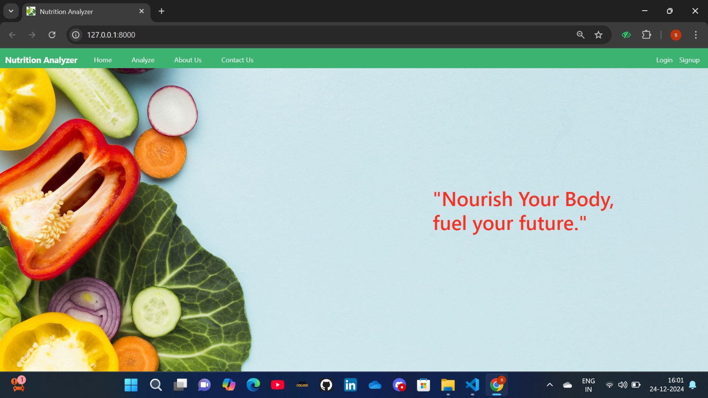 |
| 🔑 Login | 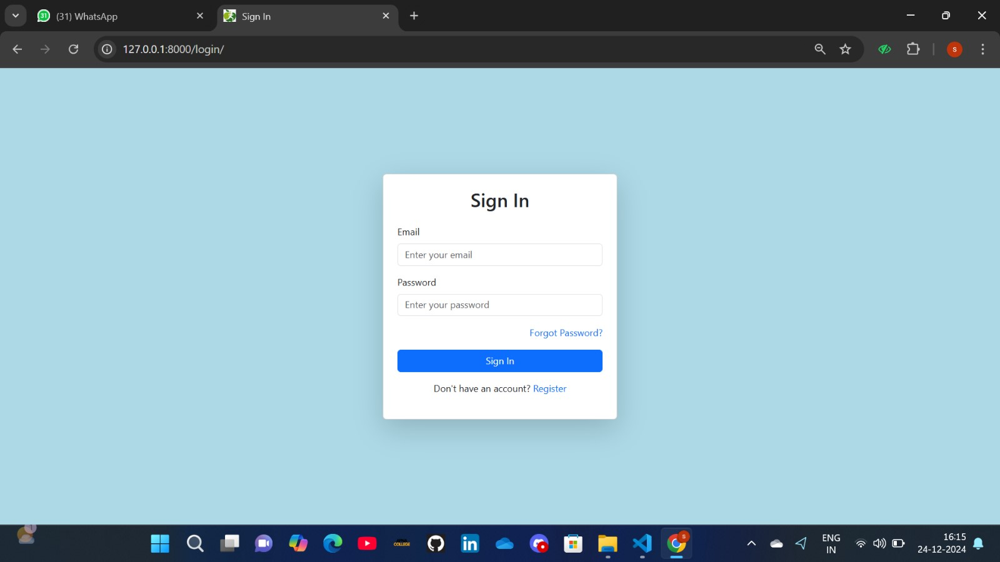 |
| 📝 Register | 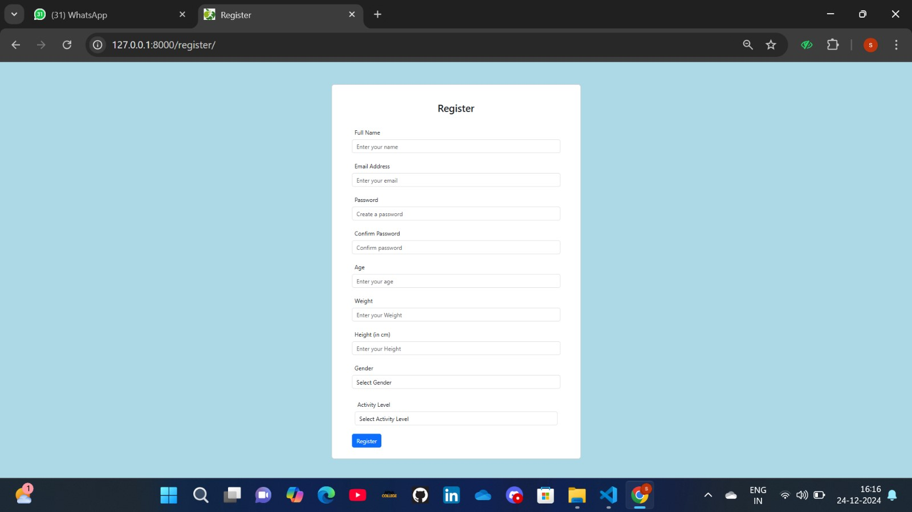 |
| 📊 Analyze Input | 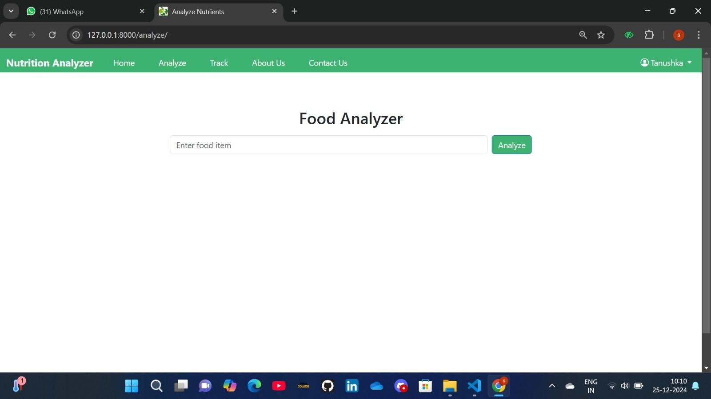 |
| 📈 Chart Output | 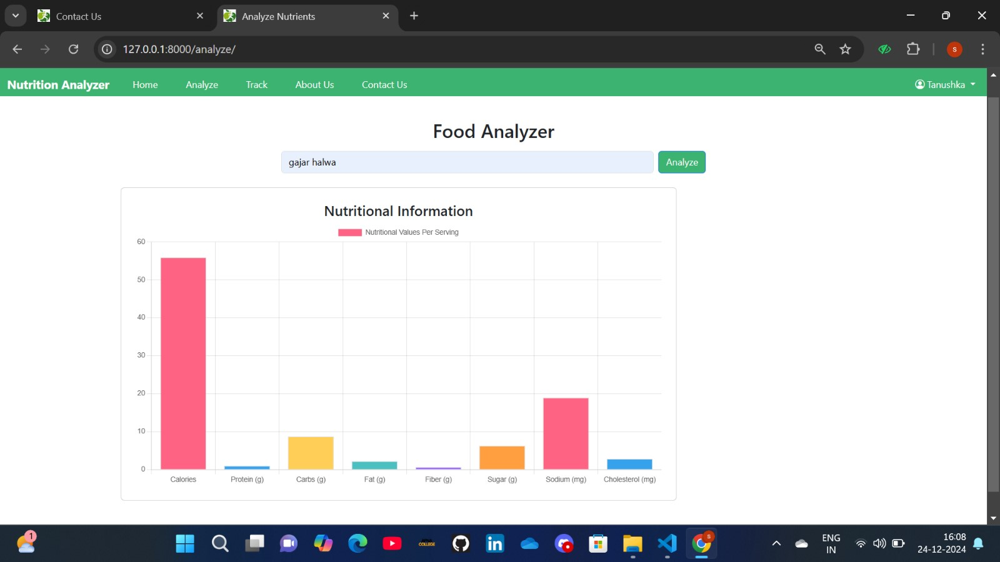 |
| 📅 Daily Tracker | 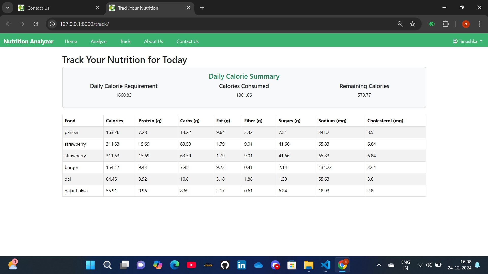 |
| 👤 Profile | 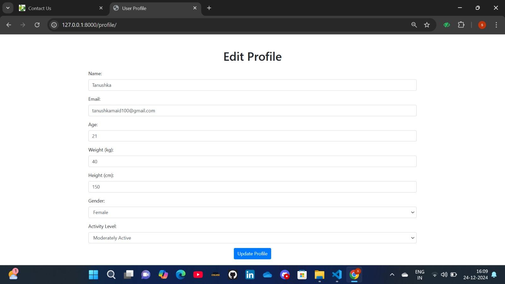 |
| 📞 Contact | 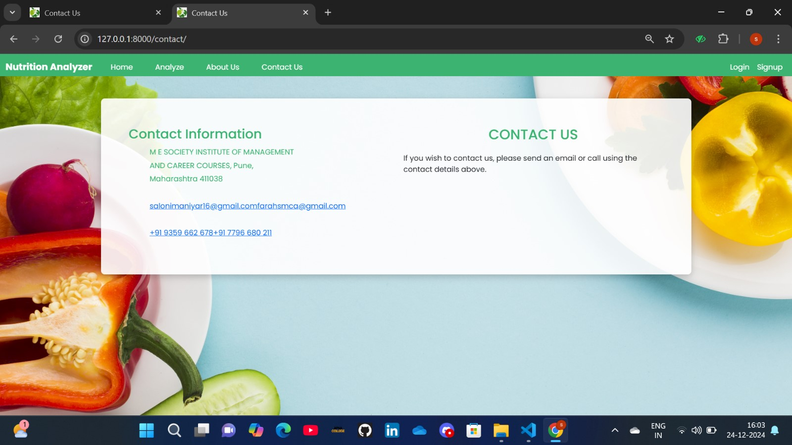 |
| ℹ️ About | 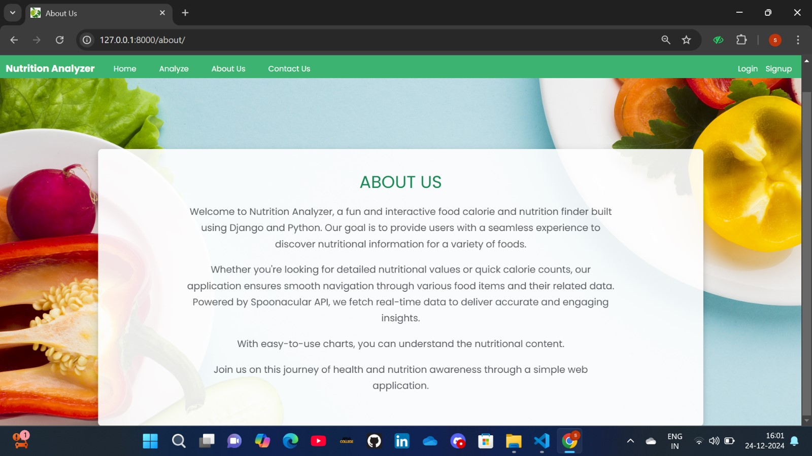 |
| ⚙️ Admin Login | 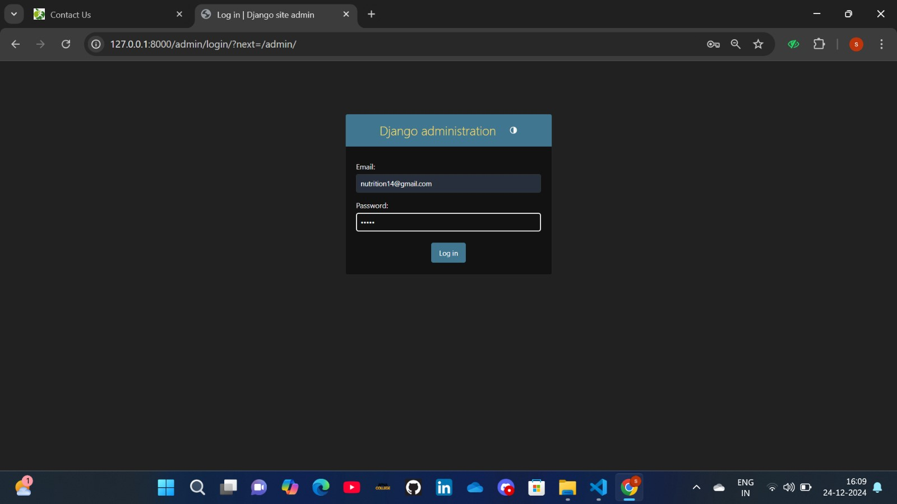 |
| 📁 Admin View | 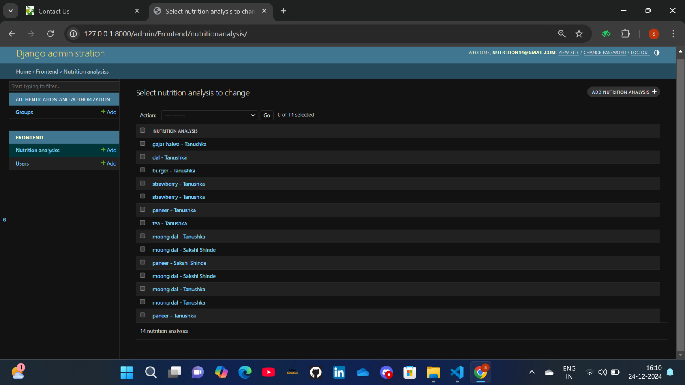 |
| 👥 Admin User Mgmt | 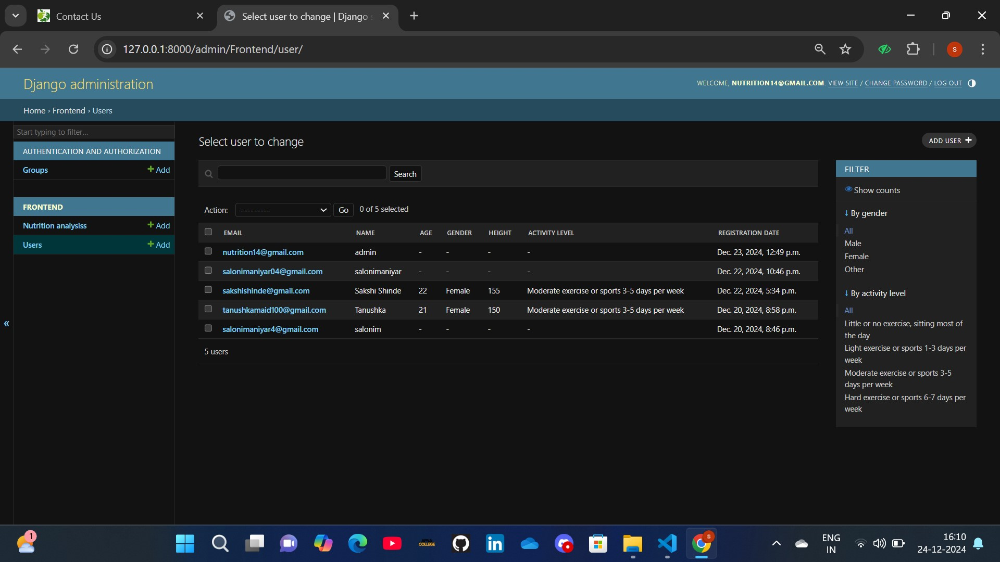 |

---

## ⚙️ Setup Instructions

1. **Clone the Repo**

   ```bash
   git clone https://github.com/Saloni-Maniyar/NutritionProjectUpdate.git
   cd NutritionProjectUpdate
   ```

2. **Create a virtual environment & activate**

   ```bash
   python -m venv venv
   venv\Scripts\activate  # For Windows
   ```

3. **Install dependencies**
<!-- 
   ```bash
   pip install -r requirements.txt
   ``` -->

4. **Configure MySQL Database**

   - Create a MySQL database (e.g., `nutrition_db`)
   - Update `settings.py`:

     ```python
     DATABASES = {
         'default': {
             'ENGINE': 'django.db.backends.mysql',
             'NAME': 'nutrition_db',
             'USER': 'your_mysql_user',
             'PASSWORD': 'your_password',
             'HOST': 'localhost',
             'PORT': '3306',
         }
     }
     ```

5. **Apply migrations**

   ```bash
   python manage.py makemigrations
   python manage.py migrate
   ```

6. **Run the server**

   ```bash
   python manage.py runserver
   ```

7. Open your browser: `http://127.0.0.1:8000`

---

## ✅ Future Enhancements

- Integration with real-time nutrition APIs
- Role-based permissions using Django Groups
- Deploy on Render or Railway

---

## 📌 Author

👤 **Saloni Maniyar**  
📧 [salonimaniyar4@gmail.com](mailto:salonimaniyar4@gmail.com)
